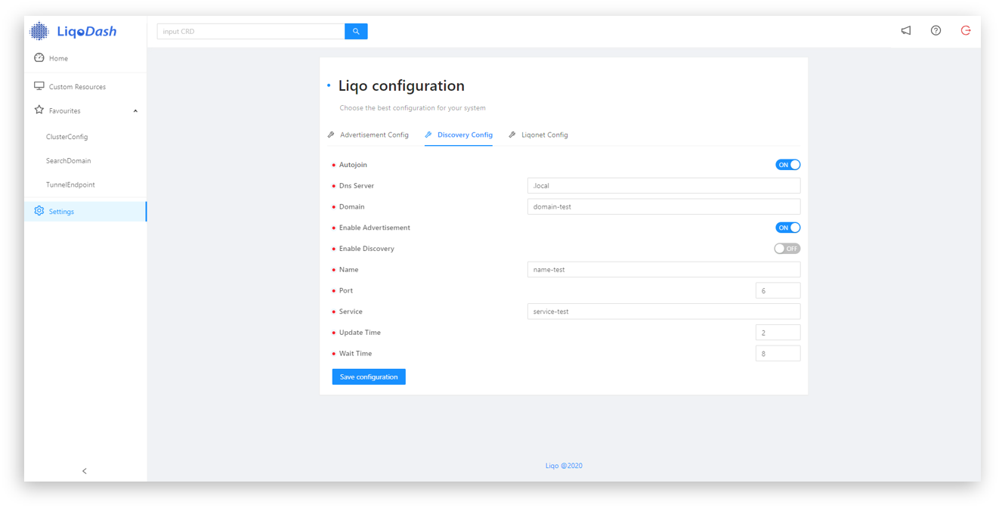

# LiqoDash
LiqoDash is a web-based UI for [Liqo](https://github.com/LiqoTech/liqo). It allows you to visualize and manage
all the Liqo components, as well as manage the status of the Liqo system itself.
LiqoDash is also a general purpose, dynamic dashboard that let you create your own
views, and fully customize your resources.

### Features
- **Visualize**: View your components, custom resources and shared applications with a user friendly,
easy to explore UI.
- **Manage**: Every Liqo component, as well as your custom resources, can be added, modified or deleted in your cluster
(all CRUD operations are supported) directly in the dashboard. 
- **No more YAML**: With the implementation of a fully dynamic CRD form generator,
you can create (or update) your custom resources without the need of writing in YAML (still, that option is
available) 
- **Configure**: The configuration is an important part of Liqo, and LiqoDash offers a dedicated view to help
users understand and choose the best configuration for their system.
- **Dynamic Dashboard**: LiqoDash meets the need for a generic user to have under control only what is necessary, offering the 
possibility to easily create dynamic views directly accessible in the dashboard, with just the components (custom resources)
they need to monitor. Components in these views are resizable and support drag and drop.
- **Customize**: Kubernetes users often work with custom resources, but there is no real way to view them besides
reading the YAML; LiqoDash offers a customizable way to manage the representation of these resources with the
usage of a built-in editor that let you choose between different templates (from the classic pie charts or bar chart,
to a more complex design such as a network graph).
- **Authentication**: The acces to you cluster's apiserver is secure and managed in two ways: through an OIDC provider 
(e.g keycloack) or with a secret token generated in your cluster.
- **Real time event responsiveness**: If a resource or component gets updated (or added/deleted) outside the dashboard,
the dashboard will be automatically updated without the need to refresh the page.

### Limitations
- **Home page**: First page that shows status and overall view of Liqo yet to implement
- **CRD templates**: The set of customizable templates can be expanded.

